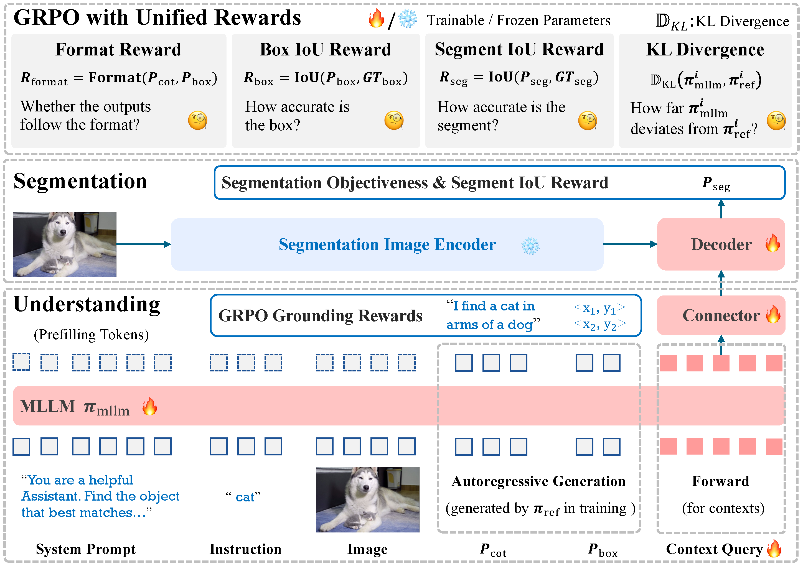
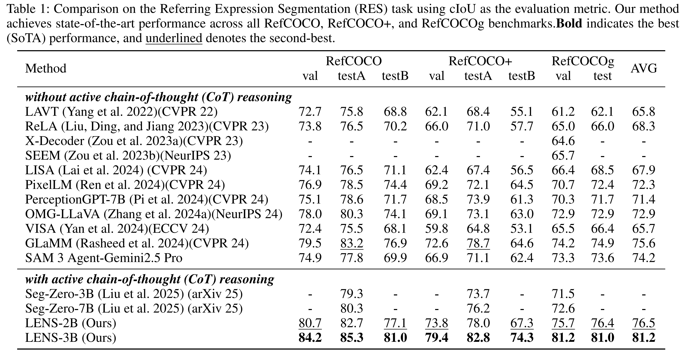
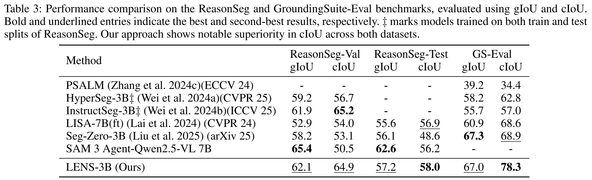

<div align ="center">
<h1> LENS </h1>
<h3> Learning to Segment Anything with Unified Reinforced Reasoning </h3>

[Lianghui Zhu](https://github.com/Unrealluver)<sup>1,\*</sup>, [Bin Ouyang](https://github.com/catchcodes)<sup>1,\*</sup>, [Yuxuan Zhang](https://github.com/CoderZhangYx)<sup>1</sup>, [Tianheng Cheng](https://scholar.google.com/citations?user=PH8rJHYAAAAJ&hl=zh-CN)<sup>1,🌟</sup>, [Rui Hu](https://github.com/isfinne)<sup>1</sup>, [Haocheng Shen](https://scholar.google.com/citations?user=AfC_R58AAAAJ&hl=en)<sup>2</sup>, [Longjin Ran](https://github.com/shanren7)<sup>2</sup>, [Xiaoxin Chen](https://scholar.google.com/citations?hl=zh-CN&user=SI_oBwsAAAAJ)<sup>2</sup>, [Li Yu](https://hustdmin.github.io/)<sup>1</sup>, [Wenyu Liu](http://eic.hust.edu.cn/professor/liuwenyu/)<sup>1</sup>, [Xinggang Wang](https://xwcv.github.io/)<sup>1 📧</sup>

<sup>1</sup> Huazhong University of Science and Technology, <sup>2</sup> vivo Mobile Communication Co., Ltd

(\* equal contribution, 🌟 Project lead, 📧 corresponding author)

[Homepage🏠](https://hustvl.github.io/LENS/) AAAI 2026 **Oral** [arXiv📄](https://arxiv.org/pdf/2508.14153)

</div>

### News
* **` Nov. 8th, 2025`:** **LENS is accepted by AAAI 2026 (Oral)!** 🎉🎉🎉
* **` Oct. 22nd, 2025`:** Training code and pretrained weights have been released! 🚀 
* **` Aug. 14th, 2025`:** We’ve released our paper on arXiv, along with the eval and demo code. Models and train code are coming soon — stay tuned! ☕️

## Abstract
Text-prompted image segmentation enables fine-grained visual understanding and is critical for applications such as human-computer interaction and robotics. However, existing supervised fine-tuning methods typically ignore explicit chain-of-thought (CoT) reasoning at test time, which limits their ability to generalize to unseen prompts and domains. To  address this issue, we introduce LENS, a scalable reinforcement-learning framework that jointly optimizes the reasoning process and segmentation in an end-to-end manner. We propose unified reinforcement-learning rewards that span sentence-, box-, and segment-level cues, encouraging the model to generate informative CoT rationales while refining mask quality. Using a publicly available 3-billion-parameter vision–language model, i.e., Qwen2.5-VL-3B-Instruct, LENS achieves an average cIoU of 81.2% on the RefCOCO, RefCOCO+, and RefCOCOg benchmarks, outperforming the strong fine-tuned method, i.e., GLaMM, by up to 5.6%. These results demonstrate that RL-driven CoT reasoning serves as a robust prior for text-prompted segmentation and offers a practical path toward more generalizable Segment Anything models.

## Overview
<div align="center">

</div>

## Results
### Referring Expression Segmentation (RES)
<p align="center">
  
</p>

### ReasonSeg and GroundingSuite-Eval
<p align="center">
  
</p>

## Install
```bash
pip install torch torchvision --index-url https://download.pytorch.org/whl/cu126
pip install -r requirements.txt
```

## Datasets
```bash
mkdir datasets
```

[RefCOCO Series](https://github.com/dvlab-research/LISA?tab=readme-ov-file#training-data-preparation:~:text=Referring%20segmentation%20datasets%3A%20refCOCO%2C%20refCOCO%2B%2C%20refCOCOg)
```
datasets/refer_seg/
├── images/mscoco/images/train2014
├── refcoco
├── refcocog
└── refcoco+
```

[Reasonseg](https://github.com/dvlab-research/LISA?tab=readme-ov-file#training-data-preparation:~:text=Reasoning%20segmentation%20dataset%3A%20ReasonSeg)
```
datasets/reason_seg/ReasonSeg/
├── explanatory
├── test
├── train
└── val
```

[GroundingSuite-Eval](https://github.com/hustvl/GroundingSuite)
```
datasets/
├── coco/
│   └── unlabeled2017/
└── GroundingSuite-Eval.jsonl 
```

## Weights
You can download the pretrained weights from Hugging Face using the following commands. 
```bash
# RefCOCO pretrained weights
huggingface-cli download --resume-download OuyBin/LENS --local-dir ./pretrained/qwen2p5_refcoco

# Weights before ReasonSeg fine-tuning
huggingface-cli download --resume-download OuyBin/LENS_ReasonSeg --local-dir ./pretrained/qwen2p5_refcoco_1500step

# ReasonSeg fine-tuninh weights
huggingface-cli download --resume-download OuyBin/LENS_ReasonSeg_FT --local-dir ./pretrained/qwen2p5_reasonseg_ft

# ReasonSeg CoT weights
huggingface-cli download --resume-download OuyBin/LENS_ReasonSeg_CoT --local-dir ./pretrained/qwen2p5_reasonseg_cot
```

## Evaluation
```bash
mkdir pretrained
wget -O ./pretrained/sam2_hiera_large.pt "https://huggingface.co/facebook/sam2-hiera-large/resolve/main/sam2_hiera_large.pt"
bash eval.sh
```

## Demo
```python
python demo.py
```

## Train
```bash
# stage1
bash train_qwen2p5_3b_stage1.sh
# stage2
bash train_qwen2p5_3b_stage2.sh
# stage2 reasonseg finetune
bash train_qwen2p5_3b_reasonseg.sh
# stage2 reasonseg cot finetune
bash train_qwen2p5_3b_cot.sh
```

## Acknowledge
This project has referenced some excellent open-sourced repos ([PR1](https://github.com/linkangheng/PR1), [EVF-SAM](https://github.com/hustvl/EVF-SAM), [GroundingSuite](https://github.com/hustvl/GroundingSuite)). Thanks for their wonderful works and contributions to the community.

## Citation
If you find LENS is useful in your research or applications, please consider giving us a star 🌟 and citing it by the following BibTeX entry.

```bibtex
@misc{zhu2025lens,
    title={LENS: Learning to Segment Anything with Unified Reinforced Reasoning},
    author={Lianghui Zhu and Bin Ouyang and Yuxuan Zhang and Tianheng Cheng and Rui Hu and Haocheng Shen and Longjin Ran and Xiaoxin Chen and Li Yu and Wenyu Liu and Xinggang Wang},
    year={2025},
    eprint={2508.14153},
    archivePrefix={arXiv},
    primaryClass={cs.CV}
}
```
