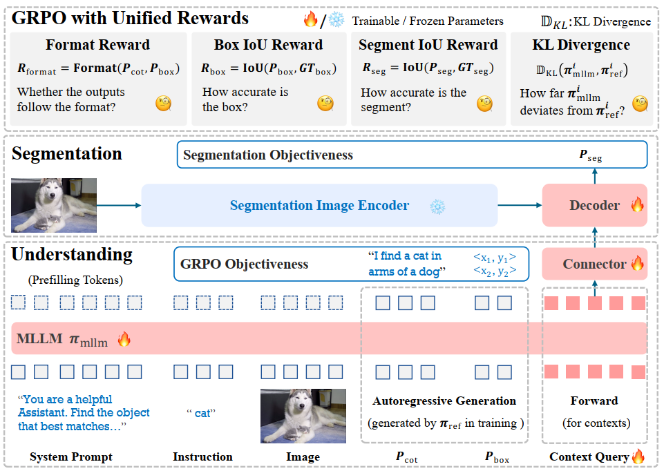
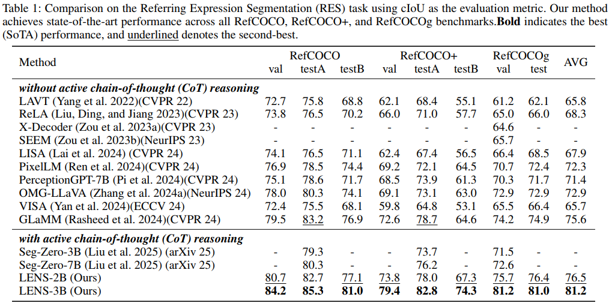
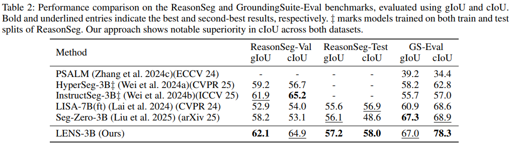

# LENS: Learning to Segment Anything with Unified Reinforced Reasoning

<p align="center">
  
</p>

## Abstract
Text-prompted image segmentation enables fine-grained visual understanding and is critical for applications such as human-computer interaction and robotics. However, existing supervised fine-tuning methods typically ignore explicit chain-of-thought (CoT) reasoning at test time, which limits their ability to generalize to unseen prompts and domains. To  address this issue, we introduce LENS, a scalable reinforcement-learning framework that jointly optimizes the reasoning process and segmentation in an end-to-end manner. We propose unified reinforcement-learning rewards that span sentence-, box-, and segment-level cues, encouraging the model to generate informative CoT rationales while refining mask quality. Using a publicly available 3-billion-parameter vision–language model, i.e., Qwen2.5-VL-3B-Instruct, LENS achieves an average cIoU of 81.2% on the RefCOCO, RefCOCO+, and RefCOCOg benchmarks, outperforming the strong fine-tuned method, i.e., GLaMM, by up to 5.6%. These results demonstrate that RL-driven CoT reasoning serves as a robust prior for text-prompted segmentation and offers a practical path toward more generalizable Segment Anything models.

## Results
### Referring Expression Segmentation (RES)
<p align="center">
  
</p>

### ReasonSeg and GroundingSuite-Eval
<p align="center">
  
</p>

## Install
```bash
pip install torch torchvision --index-url https://download.pytorch.org/whl/cu126
pip install -r requirements.txt
```

## Datasets
[RefCOCO Series](https://github.com/dvlab-research/LISA?tab=readme-ov-file#training-data-preparation:~:text=Referring%20segmentation%20datasets%3A%20refCOCO%2C%20refCOCO%2B%2C%20refCOCOg)

[Reasonseg](https://github.com/dvlab-research/LISA?tab=readme-ov-file#training-data-preparation:~:text=Reasoning%20segmentation%20dataset%3A%20ReasonSeg)

[GroundingSuite-Eval](https://github.com/hustvl/GroundingSuite)

## Model
Our trained model will be released soon.

## Evalutation
```bash
mkdir pretrained && mkdir datasets
wget https://huggingface.co/facebook/sam2-hiera-large/blob/main/sam2_hiera_large.pt ./pretrained
bash eval.sh
```

## Demo
```python
python demo.py
```

## Train
Our training script will be released soon.
